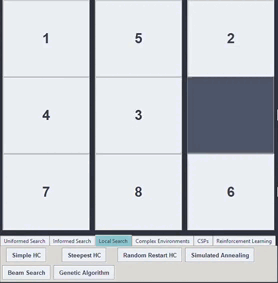
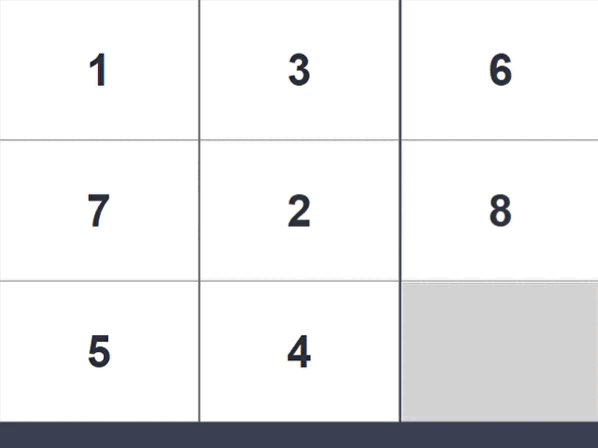

# 8-Puzzle Solver - AI Project

Giới thiệu bài toán 8-Puzzle

Bài toán 8-Puzzle là một dạng trò chơi trí tuệ kinh điển, thường được sử dụng trong giảng dạy và nghiên cứu các thuật toán tìm kiếm trong lĩnh vực trí tuệ nhân tạo. Bài toán được định nghĩa trên một bảng gồm 9 ô vuông được sắp xếp thành lưới 3x3, trong đó có 8 ô chứa các con số từ 1 đến 8 và một ô trống (thường được biểu diễn bằng số 0).

Mục tiêu của bài toán là di chuyển các ô theo hướng lên, xuống, trái hoặc phải sao cho đạt được trạng thái mục tiêu cụ thể — thông thường là sắp xếp các số theo thứ tự tăng dần từ trái sang phải, từ trên xuống dưới, và ô trống nằm ở góc dưới bên phải.

**Cấu trúc bài toán**:

Trạng thái (State): Mỗi cấu hình của lưới 3x3 tương ứng với một trạng thái cụ thể của bài toán.

Trạng thái ban đầu (Initial State): Một cấu hình ngẫu nhiên hợp lệ của các ô số.

Trạng thái mục tiêu (Goal State): Cấu hình chuẩn là [[1, 2, 3], [4, 5, 6], [7, 8, 0]].

Tập hành động (Actions): Dời ô trống (0) lên, xuống, trái, phải nếu ô trống không nằm ở biên.

Không gian trạng thái (State Space): Bao gồm tất cả các cấu hình có thể của 9 ô, tức 9! = 362.880 trạng thái. Tuy nhiên, chỉ khoảng một nửa trong số đó (181.440) là hợp lệ (có thể giải được), do tính chất bảo toàn của phép hoán vị.

Hàm chi phí (Cost Function): Mỗi hành động có chi phí bằng 1; mục tiêu là tối thiểu hóa tổng chi phí di chuyển.

Hàm đánh giá (Heuristic, nếu có): Trong các thuật toán có thông tin, hàm heuristic thường được sử dụng để ước lượng khoảng cách từ trạng thái hiện tại đến mục tiêu.

Ứng dụng trong AI

Bài toán 8-Puzzle không chỉ đơn thuần là một trò chơi mà còn là mô hình lý tưởng để nghiên cứu các thuật toán tìm kiếm, từ cơ bản đến nâng cao. Với kích thước nhỏ gọn nhưng đủ phức tạp, nó cho phép triển khai và so sánh hiệu suất của nhiều chiến lược giải quyết vấn đề như tìm kiếm không có thông tin, tìm kiếm có hướng dẫn (heuristic), tìm kiếm cục bộ, và học tăng cường.

## 1. Mục tiêu

- Mục tiêu chính của dự án này là xây dựng một hệ thống phần mềm có khả năng giải quyết bài toán 8-Puzzle bằng cách triển khai, thử nghiệm và đánh giá nhiều nhóm thuật toán tìm kiếm khác nhau trong lĩnh vực trí tuệ nhân tạo. Thông qua đó, người học và người nghiên cứu có thể:

- Hiểu rõ bản chất hoạt động của từng thuật toán trong các điều kiện cụ thể: không gian trạng thái lớn, chi phí tìm kiếm, giới hạn bộ nhớ, và khả năng hội tụ.

- So sánh hiệu suất giữa các chiến lược giải quyết vấn đề, thông qua các tiêu chí như số bước thực hiện, thời gian tính toán, mức tiêu thụ bộ nhớ và độ chính xác của lời giải.

- Thực hành trực quan hóa kết quả, nhằm giúp người dùng dễ dàng quan sát tiến trình giải của từng thuật toán thông qua hoạt ảnh (GIF) và biểu đồ hiệu suất.

- Khám phá các hướng tiếp cận đa dạng, từ các phương pháp cổ điển như BFS, DFS đến những kỹ thuật hiện đại hơn như học tăng cường hoặc tìm kiếm trong môi trường không xác định.

- Phát triển kỹ năng lập trình và mô hình hóa, khi kết hợp giữa xử lý thuật toán, thiết kế giao diện người dùng với Pygame.

- Dự án không chỉ phục vụ mục tiêu học thuật, mà còn mang tính thực tiễn cao trong việc trang bị cho người học kiến thức nền tảng về các phương pháp giải quyết bài toán trong môi trường có không gian trạng thái lớn, giới hạn quan sát, và biến thiên phức tạp — vốn là những đặc trưng phổ biến của các hệ thống thông minh trong thế giới thực.

## 2. Nội dung dự án

## 2.1. Thuật toán tìm kiếm không có thông tin (Uninformed Search)

**Minh họa:**

Nhóm thuật toán này hoạt động mà không có bất kỳ hiểu biết nào về vị trí của trạng thái mục tiêu trong không gian trạng thái. Chúng tìm kiếm một cách “mù quáng” bằng cách lần lượt duyệt qua các trạng thái theo chiến lược cụ thể. Mặc dù đơn giản, nhưng đây là nền tảng quan trọng giúp người học nắm rõ cách hoạt động cơ bản của tìm kiếm trạng thái.

Cấu hình sử dụng trong thử nghiệm:

**Trạng thái ban đầu**: [[1, 2, 3], [0, 5, 6], [4, 7, 8]]

**Trạng thái mục tiêu**: [[1, 2, 3], [4, 5, 6], [7, 8, 0]]

### a. Breadth-First Search (BFS)

BFS duyệt theo từng lớp, mở rộng các trạng thái cùng mức độ trước khi đi sâu hơn. Điều này đảm bảo nếu có lời giải thì lời giải tìm được là ngắn nhất (về số bước).

**Ưu điểm**: Luôn tìm được lời giải tối ưu nếu tồn tại.

**Nhược điểm**: Bộ nhớ tiêu tốn rất lớn do cần lưu toàn bộ trạng thái tại mỗi cấp độ.

### b. Depth-First Search (DFS)

DFS đi sâu vào một nhánh trước khi quay lại và thử nhánh khác. Không yêu cầu nhiều bộ nhớ như BFS nhưng lại tiềm ẩn nguy cơ lặp vô hạn nếu không có cơ chế kiểm soát.

**Ưu điểm**: Bộ nhớ thấp, dễ cài đặt.

**Nhược điểm**: Không đảm bảo tìm được lời giải tối ưu, dễ rơi vào vòng lặp hoặc nhánh sai.

### c. Uniform-Cost Search (UCS)

UCS tương tự BFS nhưng mở rộng trạng thái theo tổng chi phí từ đầu đến trạng thái hiện tại. Trong trường hợp chi phí mỗi bước là như nhau (như 8-Puzzle), UCS và BFS sẽ cho kết quả tương đương.

**Ưu điểm**: Tìm được lời giải có chi phí thấp nhất.

**Nhược điểm**: Cần sử dụng hàng đợi ưu tiên, có thể tiêu tốn thời gian và bộ nhớ.

### d. Iterative Deepening Search (IDS)

IDS kết hợp giữa DFS và BFS bằng cách lặp lại DFS với độ sâu tăng dần. Mỗi vòng lặp sẽ duyệt lại từ đầu nhưng chỉ đến một mức độ sâu nhất định.

**Ưu điểm**: Giảm tiêu tốn bộ nhớ như DFS, nhưng vẫn đảm bảo tìm được lời giải như BFS.

**Nhược điểm**: Có thể lặp lại việc duyệt các trạng thái đã xét ở các vòng trước, gây lãng phí thời gian.

Nhận xét:

Trong nhóm này, IDS nổi bật nhờ sự cân bằng giữa tiêu tốn tài nguyên và hiệu quả tìm kiếm. DFS tuy nhanh và nhẹ nhưng dễ sai lệch, trong khi BFS và UCS phù hợp với bài toán có dung lượng trạng thái nhỏ hoặc trung bình do yêu cầu bộ nhớ lớn.

## 2.2. Nhóm thuật toán tìm kiếm có thông tin (Informed Search)
<table>
  <tr>
    <td align="greendy">
       
      Ảnh 1
    </td>
    <td align="a_star">
       
      Ảnh 2
    </td>
    <td align="ida_star">
       
      Ảnh 3
    </td>
  </tr>
</table>

Các thuật toán trong nhóm này được gọi là “có thông tin” vì chúng sử dụng một hàm đánh giá (heuristic) để ước lượng khoảng cách từ trạng thái hiện tại đến trạng thái mục tiêu. Nhờ đó, quá trình tìm kiếm có thể được dẫn dắt một cách hiệu quả hơn, thay vì dò dẫm như các thuật toán không có thông tin.

Thuật toán Greedy Best-First Search (GBFS)

GBFS lựa chọn trạng thái kế tiếp dựa trên giá trị heuristic thấp nhất. Nó không quan tâm đến chi phí đã bỏ ra để đến trạng thái đó, mà chỉ tập trung vào việc tiến gần mục tiêu nhanh nhất có thể.

**Ưu điểm**: Tốc độ nhanh, số trạng thái cần duyệt ít.

**Nhược điểm**: Dễ mắc kẹt tại cực trị cục bộ nếu hàm heuristic không đủ chính xác. Không đảm bảo tìm được lời giải tối ưu.

Thuật toán A* (A-Star)

A* sử dụng hàm đánh giá f(n) = g(n) + h(n), trong đó:

g(n): chi phí đã đi từ trạng thái khởi đầu đến trạng thái hiện tại.

h(n): chi phí ước lượng từ trạng thái hiện tại đến mục tiêu.

Thuật toán này cân bằng giữa chi phí đã bỏ ra và tiềm năng còn lại, nhờ đó có khả năng tìm được lời giải tối ưu nếu hàm h(n) là chấp nhận được (không đánh giá quá cao).

**Ưu điểm**: Tìm được lời giải tối ưu, hoạt động ổn định.

**Nhược điểm**: Tốn nhiều bộ nhớ vì phải lưu trữ nhiều trạng thái trong hàng đợi ưu tiên.

Thuật toán Iterative Deepening A* (IDA*)

IDA* là sự kết hợp giữa A* và DFS. Thay vì lưu trữ toàn bộ trạng thái như A*, IDA* thực hiện tìm kiếm theo độ sâu tăng dần dựa trên giá trị f(n). Khi vượt quá một giới hạn cho trước, thuật toán sẽ quay lại và tăng giới hạn lên mức mới.

**Ưu điểm**: Tiết kiệm bộ nhớ hơn A*, phù hợp với không gian trạng thái lớn.

**Nhược điểm**: Cần lặp lại nhiều lần, gây tăng số lượng trạng thái bị duyệt.

Trong nhóm này, A* là lựa chọn hàng đầu nếu hệ thống có đủ tài nguyên bộ nhớ, do vừa đảm bảo lời giải ngắn nhất vừa hiệu quả trong dẫn hướng tìm kiếm. Ngược lại, IDA* phù hợp với môi trường giới hạn tài nguyên, trong khi GBFS được ưu tiên khi cần tốc độ, không quan trọng tối ưu.

## 2.3. Nhóm thuật toán tìm kiếm cục bộ (Local Optimization)

**Minh họa:**

<table>
  <tr>
    <td align="RHC">
       
      Ảnh 1
    </td>
    <td align="SHC">
       
      Ảnh 2
    </td>
    <td align="SA">
       
      Ảnh 3
    </td>
    <td align="SA">
       
      Ảnh 3
    </td>
    <td align="Beam Search">
       
      Ảnh 3
    </td>
    <td align="SAHC">
       
      Ảnh 3
    </td>
  </tr>
</table>

Tìm kiếm cục bộ là chiến lược giải quyết bài toán bằng cách chỉ tập trung vào trạng thái hiện tại và những trạng thái lân cận của nó, không quan tâm đến đường đi đã qua. Mục tiêu là liên tục cải thiện trạng thái hiện tại bằng cách chuyển sang trạng thái lân cận tốt hơn, dựa trên một hàm đánh giá cụ thể.

Các thuật toán trong nhóm này thường không đảm bảo tìm được lời giải tối ưu toàn cục mà chỉ hướng đến cực trị cục bộ, trừ khi có cơ chế giúp thoát khỏi các điểm kẹt.

- Simple Hill Climbing (SHC)

SHC là thuật toán đơn giản nhất trong nhóm này. Nó kiểm tra các trạng thái lân cận theo thứ tự, và nếu tìm thấy một trạng thái tốt hơn, nó chuyển ngay đến đó.

**Ưu điểm**: Thời gian chạy nhanh, dễ triển khai.

**Nhược điểm**: Dễ mắc kẹt tại cực trị cục bộ vì không có cơ chế quay lui hoặc đánh giá toàn cục.

- Steepest Ascent Hill Climbing (SAHC)

Khác với SHC, SAHC sẽ đánh giá toàn bộ các trạng thái lân cận và chọn trạng thái tốt nhất để di chuyển đến.

**Ưu điểm**: Có khả năng cải thiện lựa chọn mỗi bước, tăng cơ hội tiếp cận cực trị toàn cục.

**Nhược điểm**: Tốn nhiều thời gian hơn SHC do phải đánh giá toàn bộ lân cận.

- Random Hill Climbing (RHC)

RHC cũng giống SHC nhưng chọn trạng thái lân cận một cách ngẫu nhiên thay vì theo thứ tự. Nếu trạng thái đó tốt hơn, nó sẽ di chuyển.

**Ưu điểm**: Dễ tránh lặp vô hạn với một số cấu hình.

**Nhược điểm**: Không ổn định, có thể bỏ lỡ trạng thái tốt nhất do lựa chọn ngẫu nhiên.

- Simulated Annealing (SA)

SA sử dụng một kỹ thuật gọi là “làm nguội” – cho phép chấp nhận cả những trạng thái tệ hơn hiện tại với một xác suất nhất định, nhằm mục tiêu thoát khỏi cực trị cục bộ.

**Ưu điểm**: Có khả năng khám phá không gian rộng hơn, tránh kẹt tại điểm không tối ưu.

**Nhược điểm**: Cần điều chỉnh các tham số (nhiệt độ, tốc độ nguội) hợp lý, thời gian chạy dài hơn.

- Beam Search

Thuật toán này giữ một số lượng trạng thái tốt nhất (gọi là beam width) trong mỗi bước, thay vì chỉ một như Hill Climbing.

**Ưu điểm**: Kết hợp giữa khám phá và khai thác, ít rơi vào cực trị cục bộ hơn.

**Nhược điểm**: Nếu beam width quá nhỏ, dễ bị bỏ lỡ trạng thái tốt hơn.

- Genetic Algorithm (GA)

GA mô phỏng quá trình tiến hóa tự nhiên thông qua chọn lọc, lai ghép và đột biến trên một quần thể trạng thái. Mỗi cá thể đại diện cho một lời giải.

**Ưu điểm**: Khả năng khám phá rất rộng, có thể tìm được lời giải tối ưu nếu chạy đủ lâu.

**Nhược điểm**: Rất tốn tài nguyên và thời gian, phụ thuộc vào chiến lược mã hóa và tham số tiến hóa.

Nhận xét:

Nhóm Hill Climbing (SHC, SAHC, RHC) có **Ưu điểm** về tốc độ nhưng dễ mắc kẹt tại cực trị cục bộ. SA và GA có khả năng tìm lời giải tốt hơn nhờ chiến lược thoát kẹt thông minh, tuy nhiên cần nhiều thời gian và tài nguyên. Beam Search là lựa chọn cân bằng, nhưng phụ thuộc vào kích thước beam.

## 2.4. Nhóm thuật toán tìm kiếm trong môi trường phức tạp

Nhóm thuật toán này được thiết kế để xử lý các bài toán trong điều kiện không đầy đủ thông tin hoặc không xác định, khi mà trạng thái hiện tại không thể được quan sát hoàn toàn hoặc kết quả của hành động không chắc chắn. Trong 8-Puzzle, điều này được mô phỏng bằng cách tạo ra các trạng thái không rõ ràng (gọi là belief states) và yêu cầu thuật toán tìm lời giải mà tất cả các khả năng đều dẫn tới trạng thái mục tiêu.

AND-OR Search

AND-OR Search là một chiến lược giải bài toán trong môi trường không xác định bằng cách xây dựng cây tìm kiếm có chứa cả nhánh OR (lựa chọn hành động) và nhánh AND (tất cả các kết quả đều phải thỏa mãn). Thuật toán cố gắng tìm một kế hoạch đảm bảo rằng bất kể điều gì xảy ra, trạng thái mục tiêu vẫn có thể đạt được.

**Ưu điểm**: Có khả năng xây dựng các kế hoạch mạnh, phù hợp với môi trường không chắc chắn.

**Nhược điểm**: Không thu hẹp được không gian trạng thái, dẫn đến cây tìm kiếm rất lớn, tiêu tốn tài nguyên.

**Minh họa:**

Belief State Search

Trong Belief Search, thay vì làm việc với một trạng thái đơn lẻ, thuật toán duy trì một tập hợp các trạng thái khả dĩ (gọi là belief state), đại diện cho sự không chắc chắn. Khi hành động được thực hiện, tập trạng thái được cập nhật theo luật chuyển trạng thái có xác suất.

**Ưu điểm**: Mô hình hóa tốt môi trường không thể quan sát trực tiếp.

**Nhược điểm**: Gọi hàm heuristic nhiều lần để thu hẹp tập belief khiến thời gian xử lý cao.

**Minh họa:**

Partial Observable Search (POS)

POS là một cải tiến từ Belief Search, nơi hệ thống có thể quan sát được một phần trạng thái (ví dụ: biết số 1 nằm ở góc trên trái). Dựa vào thông tin quan sát được, POS có thể loại bỏ sớm các trạng thái không phù hợp, từ đó thu hẹp không gian tìm kiếm.

**Ưu điểm**: Hiệu quả cao do loại bỏ trạng thái sai ngay từ đầu, cân bằng giữa thời gian và bộ nhớ.

**Nhược điểm**: Phụ thuộc vào độ chính xác của thông tin quan sát.

**Minh họa:**

Nhận xét

POS là phương án tối ưu khi hệ thống có thể cung cấp thông tin quan sát, nhờ khả năng thu hẹp belief state sớm.

Belief Search phù hợp trong môi trường không có thông tin, nhưng hiệu suất phụ thuộc vào cách xây dựng heuristic.

AND-OR Search đơn giản về mặt xử lý, nhưng không hiệu quả trong môi trường có nhiều trạng thái khả dĩ do không thu gọn được nhánh AND.

## 2.5. Nhóm thuật toán thỏa ràng buộc (Constraint Satisfaction Problem - CSP)

<table>
  <tr>
    <td align="backtracking">
       
      Ảnh 1
    </td>
    <td align="forwarc checking">
       
      Ảnh 2
    </td>
    <td align="min conflicts">
       
      Ảnh 3
    </td>
    <td align="thay đổi cấu trúc thuật toán để giải 8puzzle thường">
       
      Ảnh 3
    </td>
  </tr>
</table>

Bài toán thỏa ràng buộc (CSP) là một lớp bài toán trong đó mục tiêu là tìm một cấu hình thỏa mãn một tập hợp các điều kiện (ràng buộc) định trước. Thay vì đi tìm đường đi trong không gian trạng thái, các thuật toán CSP tập trung vào quá trình gán giá trị cho các biến sao cho không vi phạm ràng buộc nào.

Trong ngữ cảnh 8-Puzzle, bài toán CSP được xây dựng bằng cách xem mỗi ô vuông là một biến, và các giá trị cần gán là các số từ 0 đến 8, với những ràng buộc nhất định như: mỗi số chỉ xuất hiện một lần, phải tạo thành trạng thái giải được, và tuân thủ một vài quy tắc hình học cụ thể (ví dụ ô sau lớn hơn ô trước, theo hàng hoặc cột).

Backtracking Search

Là chiến lược cơ bản nhất, thực hiện việc gán giá trị theo thứ tự và quay lui khi gặp xung đột. Thuật toán duyệt cây trạng thái theo chiều sâu, và quay lại khi phát hiện không thể tiếp tục.

**Ưu điểm**: Dễ hiểu, dễ cài đặt.

**Nhược điểm**: Tốn thời gian khi không có chiến lược chọn biến tốt.

Forward Checking

Là một mở rộng của Backtracking, sử dụng kỹ thuật kiểm tra trước (forward checking) để loại bỏ giá trị không hợp lệ khỏi miền của các biến chưa gán sau mỗi lần gán. Có thể kết hợp thêm chiến lược chọn biến như:

MRV (Minimum Remaining Values): chọn biến có ít giá trị hợp lệ nhất.

LCV (Least Constraining Value): chọn giá trị ít làm hẹp lựa chọn của biến khác.

**Ưu điểm**: Giảm số trạng thái cần duyệt.

**Nhược điểm**: Tốn công tính toán miền hợp lệ mỗi bước.

Min-Conflicts

Chiến lược này bắt đầu với một trạng thái đầy đủ (có thể không hợp lệ), và liên tục điều chỉnh các biến gây xung đột sao cho số lượng vi phạm giảm dần.

**Ưu điểm**: Hiệu quả với bài toán lớn, có thể tiếp cận nghiệm nhanh.

**Nhược điểm**: Không đảm bảo luôn tìm được nghiệm, có thể kẹt ở trạng thái xung đột cục bộ.

Nhận xét

Min-Conflicts là lựa chọn lý tưởng trong các bài toán lớn và không yêu cầu tối ưu tuyệt đối.

Forward Checking thích hợp khi cần đảm bảo tính chính xác, nhưng phải đánh đổi thời gian tính toán.

Backtracking phù hợp để minh họa nguyên lý cơ bản, nhưng không nên dùng cho không gian tìm kiếm lớn hoặc nhiều ràng buộc chặt chẽ.

## 2.6. Nhóm thuật toán học tăng cường (Reinforcement Learning - RL)

Học tăng cường là một nhánh quan trọng của trí tuệ nhân tạo, nơi một tác nhân (agent) học cách ra quyết định thông qua tương tác với môi trường. Thay vì được cung cấp sẵn dữ liệu huấn luyện hoặc hướng dẫn cụ thể, tác nhân phải tự mình khám phá chiến lược tối ưu bằng cách thử – sai và tối đa hóa tổng phần thưởng nhận được.

Trong bài toán 8-Puzzle, tác nhân sẽ bắt đầu từ trạng thái ban đầu và thực hiện các hành động (di chuyển ô trống) để đạt đến trạng thái mục tiêu. Mỗi hành động đều được gán phần thưởng, và thuật toán sẽ học dần cách hành động sao cho tổng phần thưởng tích lũy là cao nhất.

Q-Learning

Đây là một thuật toán cơ bản và phổ biến trong học tăng cường, hoạt động theo nguyên tắc cập nhật giá trị Q (Q-value) cho mỗi cặp trạng thái – hành động. Giá trị này thể hiện “lợi ích kỳ vọng” của hành động đó tại trạng thái đó.

Hàm cập nhật Q:

css

Sao chépChỉnh sửa

Q(s, a) ← Q(s, a) + α [r + γ max(Q(s’, a’)) - Q(s, a)]

Trong đó:

α: tốc độ học (learning rate)

γ: hệ số chiết khấu (discount factor)

r: phần thưởng nhận được

s’: trạng thái mới sau khi thực hiện hành động a

Chính sách hành động: Q-Learning thường dùng chiến lược Epsilon-Greedy để cân bằng giữa khám phá (exploration) và khai thác (exploitation), tức:

Với xác suất ε → chọn ngẫu nhiên (khám phá).

Với xác suất 1 - ε → chọn hành động có Q-value cao nhất (khai thác).

**Ưu điểm**

Có khả năng học và tổng quát hóa chiến lược tối ưu thông qua kinh nghiệm.

Không cần mô hình môi trường (không cần biết trước luật chuyển trạng thái).

Phù hợp với môi trường không xác định hoặc thay đổi.

**Nhược điểm**

Cần số lượng lớn lần tương tác (episodes) để hội tụ.

Hiệu suất ban đầu thấp do mất thời gian học.

Dễ mắc kẹt ở các chiến lược chưa tối ưu nếu ε không được điều chỉnh tốt.

Trong ngữ cảnh 8-Puzzle

Do không gian trạng thái của 8-Puzzle là khá lớn (trên 180,000 trạng thái giải được), Q-Learning cần rất nhiều vòng huấn luyện để xây dựng được bảng Q đầy đủ. Điều này khiến thời gian huấn luyện kéo dài. Hơn nữa, vì môi trường có thể mô hình hóa rõ ràng, việc dùng Q-Learning để giải bài toán này là hơi quá mức cần thiết.

Tuy vậy, Q-Learning vẫn là một ví dụ rất hữu ích để minh họa cách học từ tương tác, và có thể mở rộng cho các bài toán phức tạp hơn (như robot, game, điều khiển tối ưu...).

Nhận xét tổng kết

Q-Learning phù hợp khi mô hình môi trường không xác định, hoặc không thể biểu diễn rõ bằng luật chuyển trạng thái.

Trong 8-Puzzle, thuật toán này đóng vai trò mô phỏng và minh họa, không phải là lựa chọn tối ưu về hiệu suất.

Với đủ thời gian huấn luyện và dữ liệu tương tác, Q-Learning vẫn có khả năng hội tụ về chính sách giải đúng.

**Minh họa:**

##  Tổng so sánh giữa các nhóm thuật toán

| Nhóm thuật toán | **Ưu điểm** nổi bật | **Nhược điểm** chính | Phù hợp với |
|-----------------|------------------|------------------|--------------|
| Uninformed Search (BFS, DFS, UCS, IDS) | Cơ bản, dễ hiểu, nền tảng học thuật | Tốn bộ nhớ, không dẫn hướng tốt | Bài toán nhỏ, học thuật |
| Informed Search (A*, GBFS, IDA*) | Tối ưu, nhanh với heuristic tốt | Tốn tài nguyên | Môi trường có thể đánh giá tốt |
| Local Search (Hill Climbing, SA, GA) | Tốc độ cao, khám phá tốt | Không đảm bảo tối ưu toàn cục | Bài toán lớn, cần tốc độ |
| Partial/Belief/AND-OR Search | Xử lý tốt môi trường bất định | Cây tìm kiếm lớn, chậm | Môi trường không chắc chắn |
| Constraint Satisfaction (CSP) | Giải bài toán ràng buộc hiệu quả | Khó mở rộng bài toán phức tạp | Bài toán có ràng buộc cụ thể |
| Reinforcement Learning (Q-Learning) | Học từ tương tác, không cần mô hình | Tốn thời gian huấn luyện | Môi trường không xác định rõ ràng |

**Biểu đồ minh họa**

## Hướng dẫn cách sử dụng 
**Yêu cầu tối thiểu là python 3.6**
-  Khuyến khích sử dụng visual studio Code

-  Mở folder doan bằng vscode chạy bằng tổ hợp phím ctrl F5

-  Bạn có thể thay đổi nhóm thuật toán ở phần tab

-  Có thể thay đổi các thứ tự các puzzle bằng nút random

-  Nếu bạn muốn tự nhập thứ tự puzzle mà mình muốn thì nhập vào đây

-  Cuối cùng bạn chỉ cần chọn thuận toán để chạy

## 3. Tác giả

Dự án được thực hiện bởi:

**Họ và tên**: Lê Thanh Tân

**MSSV**: 23110316

**Trường/Ngành**: Trường đại học sư phạm kĩ thuật 

Đây là một đồ án cá nhân trong khuôn khổ học phần Trí tuệ nhân tạo, nhằm mục tiêu:

Ứng dụng các thuật toán tìm kiếm để giải quyết một bài toán kinh điển.

Trực quan hóa quá trình hoạt động của từng nhóm thuật toán.

So sánh hiệu suất giữa các hướng tiếp cận khác nhau.

Tăng cường kỹ năng lập trình, phân tích và trình bày học thuật.

## 4. Tài liệu tham khảo

1. Stuart Russell & Peter Norvig (2020), Artificial Intelligence: A Modern Approach, 4th Edition, Pearson.

2. Stuart Russell & Peter Norvig (2016), Artificial Intelligence: A Modern Approach, 3rd Edition, Pearson.

3. Stanford University – CS229: Reinforcement Learning and Control (Lecture Notes).

4. diễn đàn facebook:"sinh viên công nghệ thông tin"

Các công cụ hỗ trợ: ChatGPT, Grok AI, Python, Google Colab.

